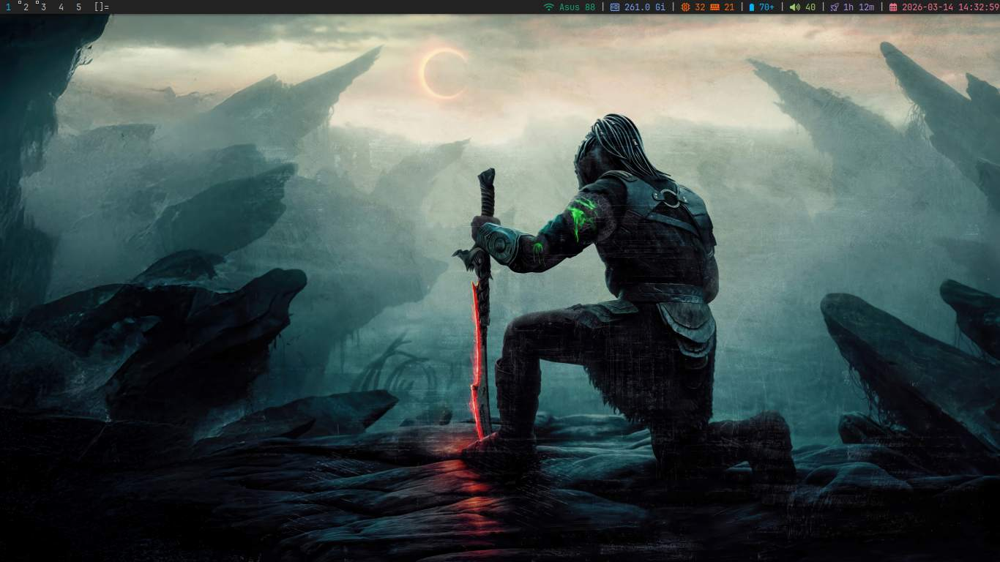

# Sava's Arch Build



## Install by first cloning this repo to the sab directory

```
git clone https://github.com/SavaAlexandruStefan/Reuse-An-Old-Computer-with-Arch-and-DWM.git sab
```

Enter the directory

```
cd sab
```

## Customize

Edit packages.txt to add or remove packages
```
vim packages.txt
```

## Installation

Run the script
```
./install.sh
```

Includes:

## Window Manager
- dwm
- slstatus patched to allow colors

[DWM Readme](dwm/README.md)

[SLStatus README](slstatus/README.md)


## Scripts

- music playback with dunst notifications
- screenshot
- volume control with dunst notifications

> This scripts are here to give you a starting point. You SHOULD modify them or create other scripts to help your workflow.
